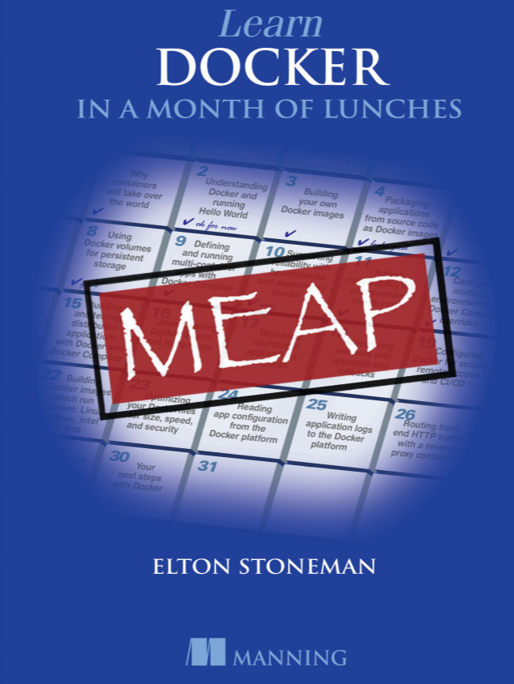

# [Learn Docker in a Month of Lunches](https://www.manning.com/books/learn-docker-in-a-month-of-lunches)

This is the source code for my Manning book _Learn Docker in a Month of Lunches_.

> It's a work in progress but you can get all the completed chapters using [Manning's Early Access Program](https://www.manning.com/books/learn-docker-in-a-month-of-lunches).

## Elevator Pitch

Go from zero to production readiness with Docker in 21 bite-sized lessons! _Learn Docker in a Month of Lunches_ is an accessible task-focused guide to Docker on Linux, Windows, or Mac systems. 

In it you'll learn practical Docker skills to help you tackle the challenges of modern IT, from cloud migration and microservices to handling legacy systems. 

There's no excessive theory or niche-use cases - just a quick-and-easy guide to the essentials of Docker you'll use every day.

## A Note About Tech Accessibility

One important thing about Learn Docker in a Month of Lunches: I want it to be as accessible as possible. Too many Docker books assume that you're a Linux guru, and they give you exercises that work only on Intel machines and make sense only if you've spent years working as a sysadmin. 

This book is different. All the code samples and exercises are cross-platform and work on Windows, Mac, Linux, Intel, and Arm. You should be able to follow along with Windows 10 on your desktop, OSX on your MacBook, or Debian on your Raspberry Pi. 

I've also tried hard to assume a minimum amount of background knowledge — Docker crosses the boundaries of architecture, development, and operations, and I've tried to do the same. This book should work for you whatever your background in IT.

## Cover Art

