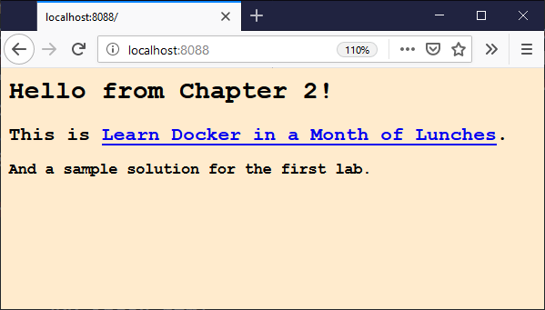

# DIAMOL Chapter 2 Lab - Sample Solution

1. Run the web container from the chapter exercises:

```
> docker container run --detach --publish 8088:80 diamol/ch02-hello-diamol-web
86b20cd8e846d7ea8cf29d08d8c22118f925cca818ab28765d218c7585dbc52d
```

> Note down the start of the container ID so you can work with the container. In this case it's `86b`

2. _[Optional]_ Check the HTML page in the container is in the expected location:

- on Linux use the `ls` command:

```
> docker container exec 86b  ls /usr/local/apache2/htdocs
index.html
```

- on Windows use the `dir` command, but you need to wrap it in a `cmd` statement:

```
docker container exec 86b cmd /s /c dir C:\usr\local\apache2\htdocs
index.html
```

3. We know where the HTML file is inside the container, so we can use `docker container cp` to copy a local file into the container. This will overwrite the `index.html` file in the container with the file in my current directory:

```
docker container cp index.html 86b:/usr/local/apache2/htdocs/index.html
```

The format of the `cp` command is `[source path] [target path]`. The container can be the source or the target, and you prefix the container file path with the container ID (`86b` here). You can use the same file path format with forward-slashes on Linux or Windows in the `cp` command.

> If you're using Windows containers on Windows 10 you may get the error _filesystem operations against a running Hyper-V container are not supported_, which means you'll need to stop the container with `docker container stop <id>` before you run the `docker container cp` command, and then start the container again afterwards with `docker container start <id>`.

4. Browse to the published port on http://localhost:8088 - you'll see your new content:



## Notes

Inside the container the Apache web server returns the contents of the HTML file at the known location. Here we've overwritten the file inside the container with a new file from the local machine. Now when Apache serves the page, it's the new content.

We haven't changed the files in the Docker image though, only in this one container. If you remove the container and start a new one, you'll see it shows the original HTML page.
