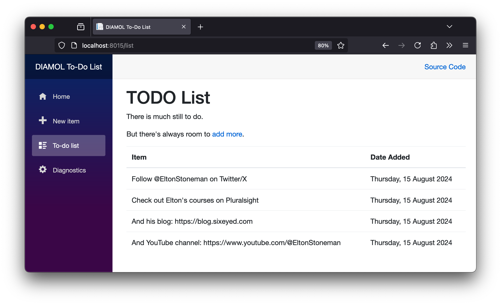

# DIAMOL Chapter 6 Lab - Sample Solution

If you've been running lots of containers from Chapter 6 and using lots of ports, you can start by tidying up:

```
docker container rm -f $(docker container ls -aq)
```

Now run a container with the latest to-do list image:

```
docker container run -d -p 8015:80 diamol/ch06-todo-list:v3
```

Browse to http://localhost:8015/list  - it should look like this:



> A set of tasks which everyone should get done :)

Let's create a volume to use for storing the database file instead:

```
docker volume create todo-list-v3
```

You can create a configuration file which specifies a different path for the database file, and that path can be your volume mount. 

My [config.json](./solution/config.json) writes data to `/new-data`.

To put that together, we'll run a container which uses:

- a read-only bind mount to load the new config file into the container
- a read-write volume mount as the target for the database file

Which is this on Windows:

```
$source="$(pwd)/solution".ToLower()
$target='C:\app\new-data'

docker container run -d -p 8016:80 `
  --mount type=bind,source=$source,target=$target,readonly `
  --volume todo-list-v3:$target `
  diamol/todo:v3
```

And this on Linux:

```
source="$(pwd)/solution"
$target='/app/new-data'

docker container run -d -p 8016:80 `
  --mount type=bind,source=$source,target=$target,readonly `
  --volume todo-list-v3:$target `
  diamol/todo:v3
```