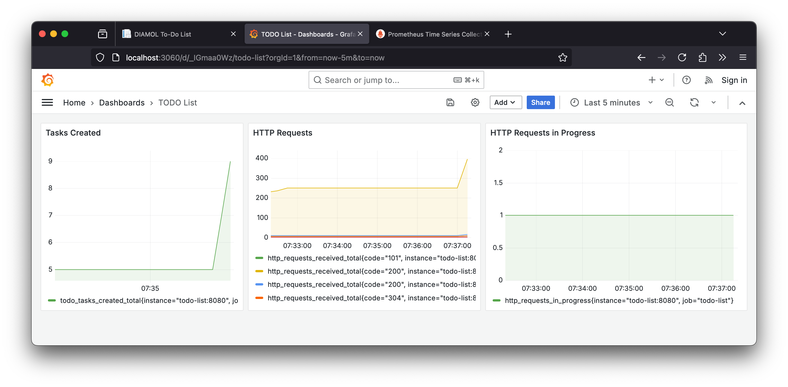

# DIAMOL Chapter 9 Lab - Sample Solution

The to-do app for this lab already has Prometheus support built in. You can check it by running:

```
docker container dun -d -p 8050:80 diamol/ch09-todo-list
```

Then browse to http://localhost:8050 and enter some tasks to do.

Browse to http://localhost:8050/metrics and you'll see the Prometheus metrics.

## The custom Prometheus image

Prometheus just needs to be configured to scrape the todo-list application.

You can see the scrape config in my [prometheus.yml](./prometheus/prometheus.yml):

```
  - job_name: "todo-list"
    metrics_path: /metrics
    static_configs:
      - targets: ["todo-list"]
```

And there's a simple [Dockerfile](./prometheus/Dockerfile) to package that config file into a Docker image.

## The custom Grafana image

I built the dashboard by running a Grafana container when I had the Prometheus and todo-list containers running. I added three basic panels to give me this:



The PromQL queries are all straightforward - there's no need for aggregation or filtering:

- `todo_tasks_created_total`
- `http_requests_received_total`
- `http_requests_in_progress`

Then I exported the JSON and saved it to [dashboard.json](./grafana/dashboard.json).

The [Dockerfile](./grafana/Dockerfile) for Grafana packages that dashboard along with the Prometheus data source (in the same way as the exercises in Chapter 9).

## Running the app with metrics

This [docker-compose.yml](docker-compose.yml) manifest starts the app with Prometheus and Grafana.

Run it with:

```
docker-compose up -d
```

Then browse to http://localhost:8050, add some tasks and check the dashboard at http://localhost:3000.
