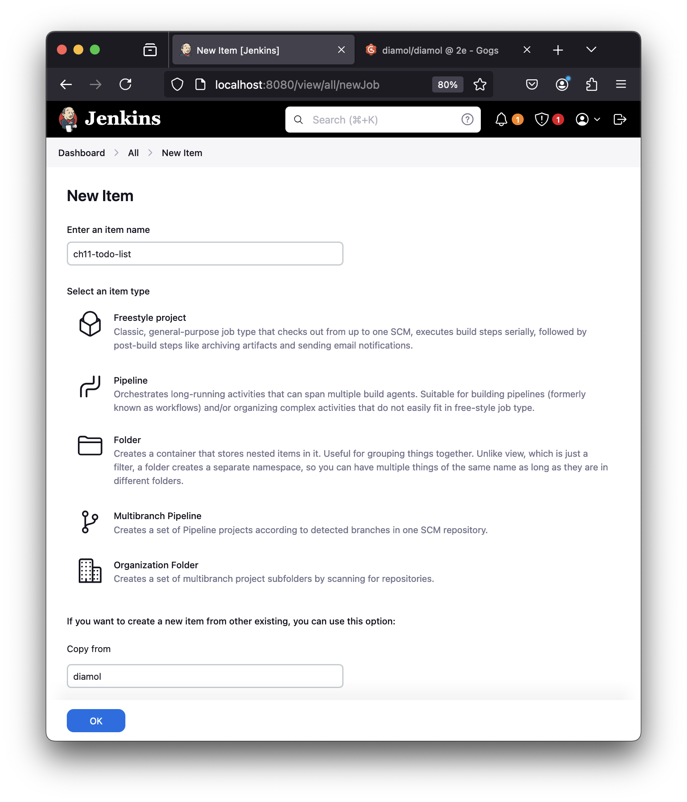
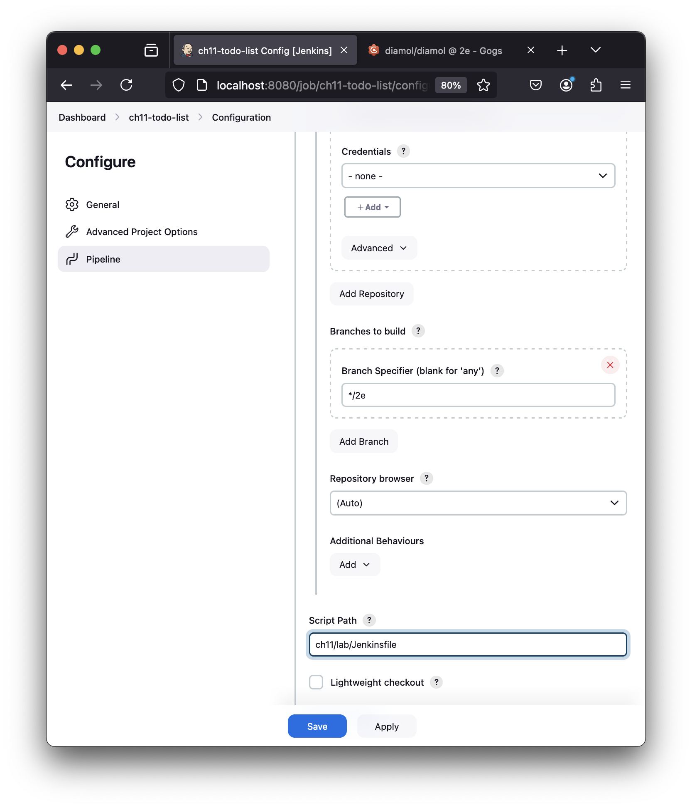
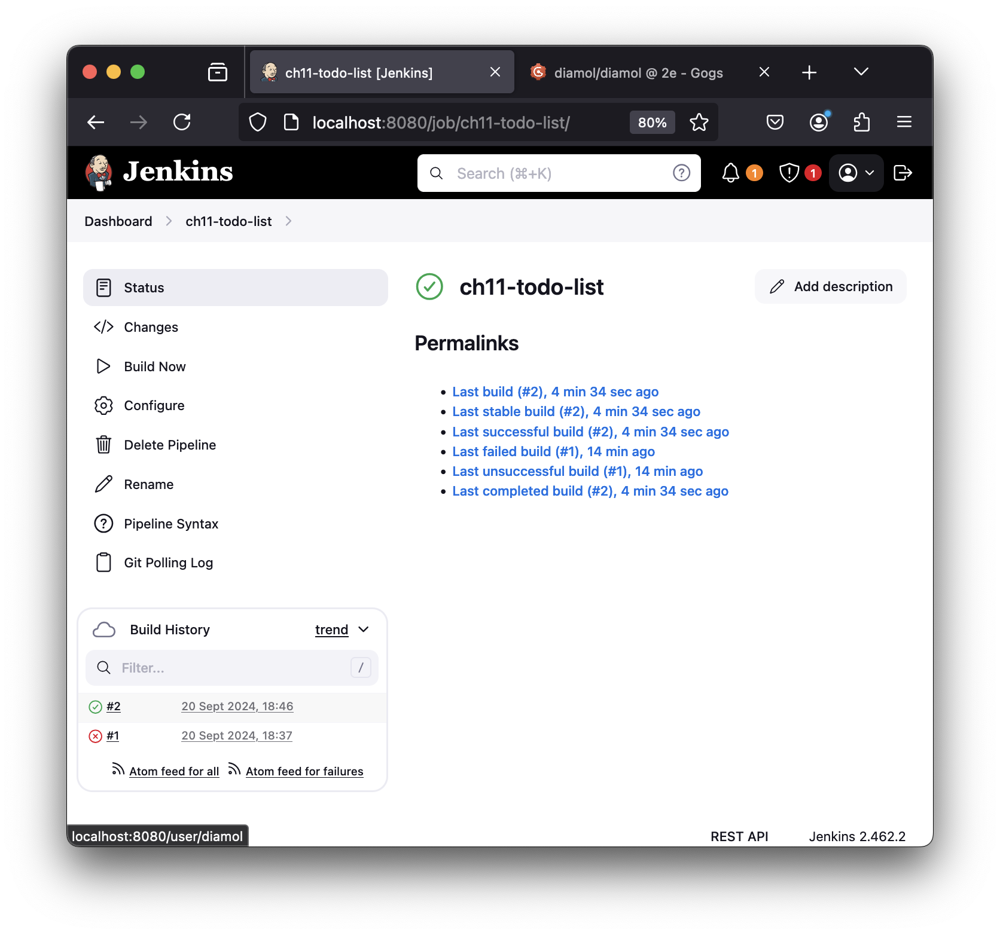
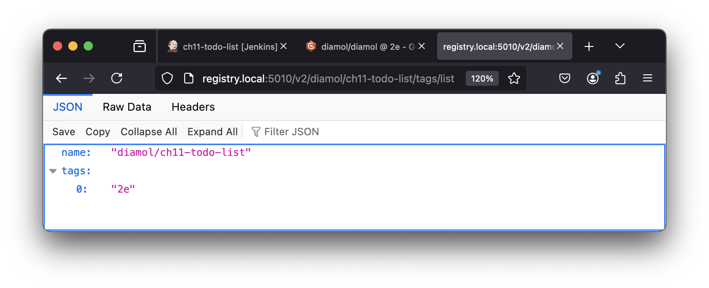

# DIAMOL Chapter 11 Lab - Sample Solution

## Run the build infrastructure

Makew sure you have Jenkins, Gogs and the registry astill running from this chapter:

```
cd ch11/exercises/infrastructure

docker compose -f docker-compose.yml -f docker-compose-linux.yml up -d

# OR on Windows
# docker compose -f docker-compose.yml -f docker-compose-windows.yml up -d
```

## Build override file

- create `docker-compose-build.yml` with this content:

```
services:
  todo-web:
    build:
      context: todo-list
      dockerfile: Dockerfile
      args:
        BUILD_NUMBER: ${BUILD_NUMBER:-0}
```

## Jenkins job

- log into Jenkins with credentials `diamol`/`diamol`

- from the Dashboard click _New Item_

- give the build a name and in the _Copy from_  box enter `diamol`:



- in the pipeline definition change script path to `ch11/lab/Jenkinsfile`:



- click _Save_ and then _Build Now_. Check the console logs if your build fails, eventually it should pass:



- check that the image has been pushed to the registry at http://registry.local:5010/v2/diamol/ch11-todo-list/tags/list

