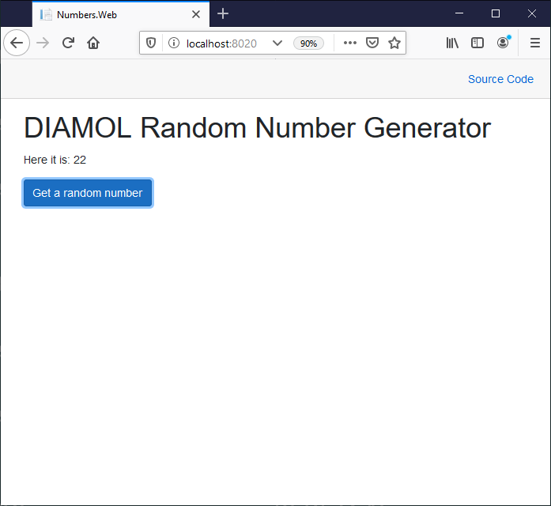

# DIAMOL Chapter 12 Lab - Sample Solution

Create network and run services:

```
docker network create --driver overlay numbers

docker service create --detach --network numbers --name numbers-api diamol/ch08-numbers-api:v3

docker service create --detach --network numbers --name numbers-web --publish 8020:80  diamol/ch08-numbers-web:v3
```

> Browse to http://localhost:8020 (or from a remote machine if you're using Windows containers)

You'll see the app:


