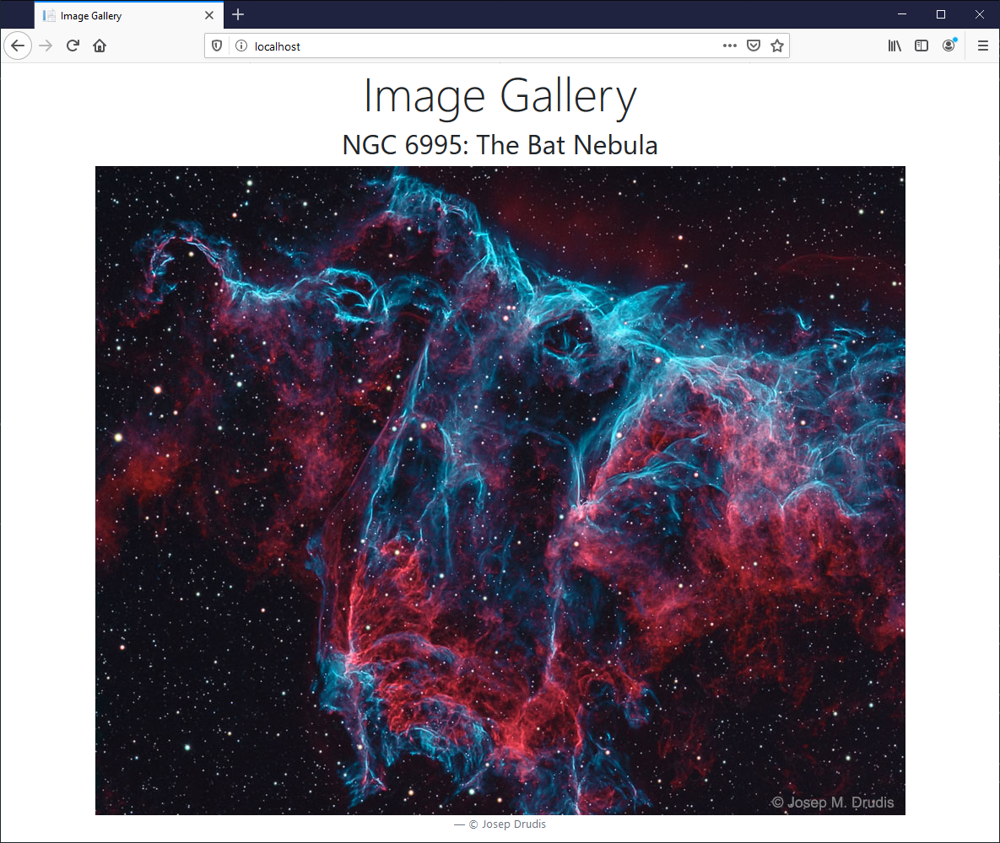

# DIAMOL Chapter 14 Lab - Sample Solution

Deploy the stack & check all replicas:

```
docker stack deploy -c image-gallery.yml image-gallery

docker stack ps image-gallery
```

Check the API service is configred and running as expected:

```
docker service inspect --pretty image-gallery_iotd

docker service ps image-gallery_iotd
```

Update to v2, joining the Compose files:

```
docker-compose -f image-gallery.yml -f v2.yml --log-level ERROR config > stack.yml

docker stack deploy -c stack.yml image-gallery

docker service ps image-gallery_iotd
```

You should see the rollout happen as expected; if the app rolls back, your healthcheck may need tweaking to give the app longer to respond.

I got this image when I ran through it today, it's pretty cool:


