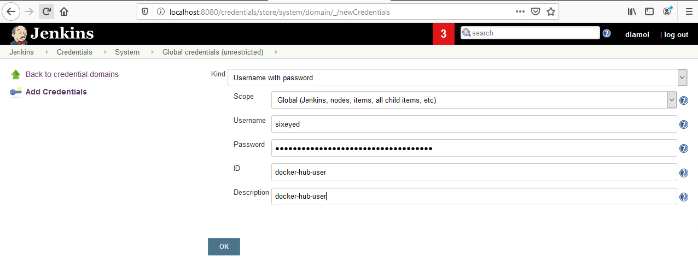
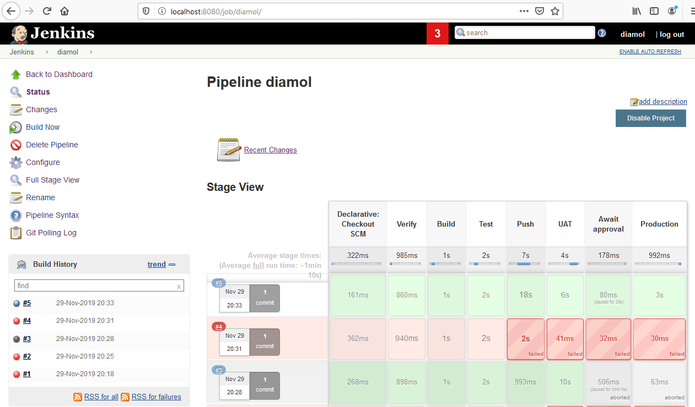

# DIAMOL Chapter 15 Lab - Sample Solution

Start by spinning up the build infrastructure. Open a terminal to this folder and then run:

```
cd infrastructure

# for Linux containers:
docker-compose -f .\docker-compose.yml -f .\docker-compose-linux.yml up -d

# OR - for Windows containers
# docker-compose -f .\docker-compose.yml -f .\docker-compose-windows.yml up -d
```

## Add a Jenkins credential for Docker Hub

Opwn Docker Hub at https://hub.docker.com/settings/security and create an access token for your account. You'll store that in Jenkins and you can delete it when you're done with the lab (which is better than using your password).

Browse to Jenkins at http://localhost:8080/credentials/store/system/domain/_/

> Log in with credentials `diamol/diamol`

Click _Add Credentials_ and add a new username/password credential called `docker-hub-user` with your Hub ID and access token:



## Set up your Git server & push code

Browse to Gogs at http://localhost:3000 and complete setup, then create a new user called `diamol` and a repository for that user also called `diamol`.

Edit [Jenkinsfile](./Jenkinsfile) (or [Jenkinsfile.windows](./Jenkinsfile.windows)) and replace `pwd-domain` with your own **secured** [Play with Docker](https://labs.play-with-docker.com) session domain.

Push your changes:

```
git add --all

git commit -m 'My domain'

git push ch15 master
```

## Run the pipeline

Browse to Jenkins at http://localhost:8080/job/diamol/ and click _Build Now_. When the build gets to the approval stage, switch back to your PWD session and check the UAT deployment (with `docker container ls` and `docker container logs`).

All good? Back to Jenkins and click the approval stage and approve the deployment to prod. When it succeeds the pipeline should be green (took me five goes :)



Back to PWD to check prod, and everything should be fine:


