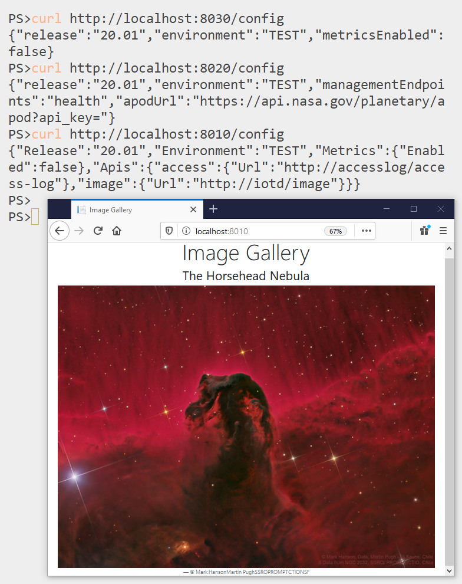

# DIAMOL Chapter 18 Lab - Sample Solution

Configuring a distributed app to load config override files and environment variables.

## Solution

My [docker-compose-solution.yml](./docker-compose-solution.yml) loads the config file for each component into a volume. The source files are named as each app expects them, so the volumes load into a directory.

The environment variable overrides the config file to set a new release cycle.

## Testing

Run the app from this directory with:

```
docker-compose -f docker-compose-solution.yml up -d
```

Then browse to each config API:

```
curl http://localhost:8030/config
curl http://localhost:8020/config
curl http://localhost:8010/config
```

You should see each app has the environment name `TEST` and the release cycle `20.01`. When you browse to http://localhost:8010 the app should work:


