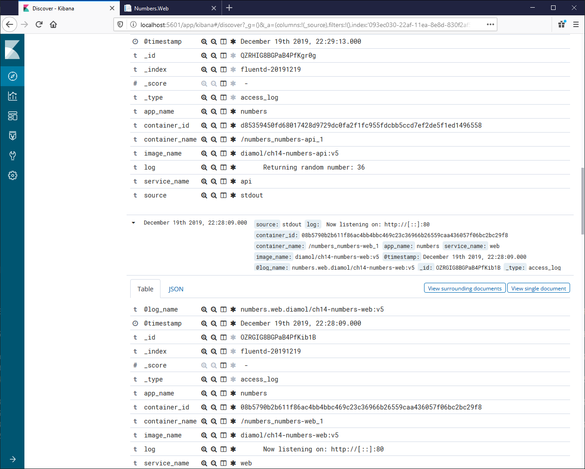

# DIAMOL Chapter 19 Lab - Sample Solution

Running the random number app with logs sent to Elasticsearch via Fluentd.

## Solution

There are three parts to my solution:

- [solution.conf](./fluentd/conf/solution.conf) - adds the Fluentd enrichment and filtering
- [fluentd/solution.yml](./fluentd/solution.yml) - Compose override to use the solution's Fluentd config
- [numbers/solution.yml](./numbers/solution.yml) - Compose override to use Fluentd for the app

## Testing

Spin up the EFK stack from this directory:

```
docker-compose -f fluentd/docker-compose.yml -f fluentd/solution.yml up -d
```

And spin up the numbers app:

```
docker-compose -f numbers/docker-compose.yml -f numbers/solution.yml up -d
```

Browse to http://localhost:8090 and generate a few random numbers.

Then browse to Kibana on http://localhost:5601:

- set the index pattern to be `fluentd`
- set the time field to be `@timestamp`

In the Discover tab you'll see log entries from the API and the Web app:


