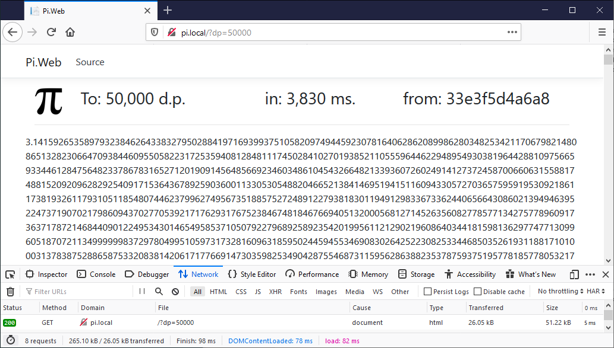

# DIAMOL Chapter 20 Lab - Sample Solution

Running a compute-heavy app behind a caching reverse proxy to improve performance.

## Before

Run the app without a proxy:

```
docker-compose up -d
```

Check the performance, computing Pi to 50K decimal places:

http://localhost:8031/?dp=50000

> That takes about 4 seconds on my dev box

Refresh the browser and the response will take just as long, because it is computed each time.

## After

Add a `pi.local` domain to your hosts file - on Mac or Linux:

```
echo \$'\n127.0.0.1 pi.local' | sudo tee -a /etc/hosts
```

**OR** on Windows:

```
Add-Content -Value "127.0.0.1 pi.local" -Path /windows/system32/drivers/etc/hosts
```

Leave the app container running, and run Nginx as a caching proxy using [this configuration file](./solution/sites-enabled/pi.local) - for Linux containers:

```
docker-compose -f solution/docker-compose.yml -f solution/override-linux.yml up -d
```

**OR** for Windows containers:

```
docker-compose -f solution/docker-compose.yml -f solution/override-windows.yml up -d
```

Browse to http://pi.local?dp=50000, this time the computed result is cached in Nginx.

Refresh the browser and the response will be immediate, because it gets served from the cache - in this screenshot the compute time is 3.8 seconds, but the actual response time is 98ms:


