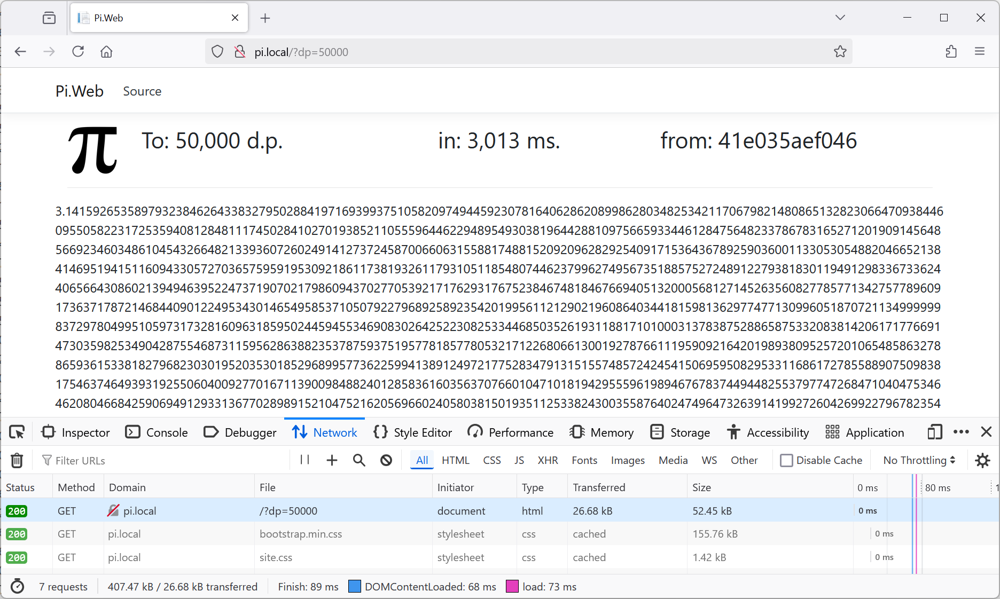

# DIAMOL Chapter 20 Lab - Sample Solution

Running a compute-heavy app behind a caching reverse proxy to improve performance.

## Before

Remove Traefik and any other containers:

```
docker rm -f $(docker ps -aq)
```

Run the app without a proxy - from the `lab` folder:

```
docker compose up -d
```

Check the performance, computing Pi to 50K decimal places:

http://localhost:8031/?dp=50000

> That takes about 3 seconds on my dev machine

Refresh the browser and the response will take just as long, because it is computed each time.

## After

Add a `pi.local` domain to your hosts file - on Mac or Linux:

```
../../scripts/add-to-hosts.sh whoami.local
```

**OR** on Windows:

```
../../scripts/add-to-hosts.ps1 -domain whoami.local
```

Leave the app container running, and run Nginx as a caching proxy using [this configuration file](./solution/sites-enabled/pi.local) :

```
docker compose -f solution/docker-compose.yml up -d
```

Browse to http://pi.local?dp=50000, this time the computed result is cached in Nginx.

Refresh the browser and the response will be immediate, because it gets served from the cache - in this screenshot the compute time is 3 seconds, but the actual response time is 80ms:


