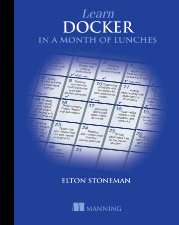

# Learn Docker in a Month of Lunches

Welcome to the book _Learn Docker in a Month of Lunches_ by [@EltonStoneman](https://twitter.com/EltonStoneman).

* You can buy the book on [Amazon](https://amzn.to/3gZHQL5)
* Or from [Manning](https://www.manning.com/books/learn-docker-in-a-month-of-lunches?utm_source=affiliate&utm_medium=affiliate&a_aid=elton&a_bid=5890141b) - _and get 40% off with the discount code `stonemanpc`_
* The source for exercises is on GitHub [sixeyed/diamol](https://github.com/sixeyed/diamol)

You can also:

* Watch on YouTube at [diamol.net/stream](https://diamol.net/stream)
* Join the [Slack channel](https://join.slack.com/t/diamol/shared_invite/zt-h3cm98vo-IRbtYMw4U0dZwbY_mLlddg)
* Win a copy at [diamol.net/giveaway](https://diamol.net/giveaway)

And when you've learned Docker, your next step is Kubernetes :)

* [Learn Kubernetes in a Month of Lunches](https://www.manning.com/books/learn-kubernetes-in-a-month-of-lunches?utm_source=affiliate&utm_medium=affiliate&a_aid=elton&a_bid=a506ee0d) - _and get 40% off with the discount code `stonemanpc`_

## Elevator Pitch

Go from zero to production readiness with Docker in 20 bite-sized lessons! _Learn Docker in a Month of Lunches_ is an accessible task-focused guide to Docker on Linux, Windows, or Mac systems. 

In it you'll learn practical Docker skills to help you tackle the challenges of modern IT, from cloud migration and microservices to handling legacy systems. 

There's no excessive theory or niche-use cases - just a quick-and-easy guide to the essentials of Docker you'll use every day.

## Live Stream & Giveaways

I'm streaming the book live in September 2020 with a chapter every weekday, and I have [copies to give away every week](https://diamol.net/giveaway). The live sessions are all recorded so you can watch them again.

> You can find all the videos in the [Learn Docker in a Month of Lunches playlist](https://www.youtube.com/playlist?list=PLXl_isu8qxvmDOAnUkG5x16LzBzGzY_Ww).

### Week 1 - Understanding Docker containers and images

* [01: Understanding Docker and running Hello, World](https://youtu.be/QTnVztPl2Uw)
* [02: Building your own Docker images](https://youtu.be/tMIrQ-XWZz8)
* [03: Packaging apps from source code into Docker images](https://youtu.be/51okXVJvSNw)
* [04: Sharing images with Docker Hub and other registries](https://youtu.be/F1aMrAqUjQk)
* [05: Using Docker volumes for persistent storage](https://youtu.be/aEqxUnZuh8A)

### Week 2 - Running distributed applications in containers

* [06: Running multi-container apps with Docker Compose](https://youtu.be/3bs4HDBRPgk)
* [07: Supporting reliability with health checks and dependency checks](https://youtu.be/5WeH7BWuV14)
* [08: Adding observability with containerized monitoring](https://youtu.be/6BcoR79AOas)
* [09: Running multiple environments with Docker Compose](https://youtu.be/VXvsy7mpdQI)
* [10: Building and testing applications with Docker and Docker Compose](https://youtu.be/lO-Lwwy04zs)

### Week 3 - Running at scale with a container orchestrator 

* [11: Understanding orchestration: Docker Swarm and Kubernetes](https://youtu.be/zvjr8gmZjkE)
* [12: Deploying distributed apps as stacks in Docker Swarm](https://youtu.be/JUEDHPNCs0U)
* [13: Automating releases with upgrades and rollbacks](https://youtu.be/XWUfb08qDYg)
* [14: Configuring Docker for secure remote access and CI/CD](https://youtu.be/0ixfI7T25zY)
* [15: Building Docker images that run anywhere: Linux, Windows, Intel & Arm](https://youtu.be/8TOFoCzie7o)

### Week 4 - Getting your containers ready for production

* [16: Optimizing your Docker images for size, speed and security](https://youtu.be/22-4YwqbTtM)
* [17: Application configuration management in containers](https://youtu.be/68luKeqXS3g)
* [18: Writing and managing application logs with Docker](https://youtu.be/_9SWydfySsQ)
* [19: Controlling HTTP traffic to containers with a reverse proxy](https://youtu.be/gEQWud2jwoA)
* [20: Asynchronous communication with a message queue](https://youtu.be/b2HeubvZMaU)

## About Me

I'm a freelance consultant and trainer, specializing in Docker, Kubernetes and Microsoft Azure. 

I spent most of my career as a consultant, designing and building large enterprise applications. Then I discovered the container revolution in 2014, joined Docker and worked with the team for three fast and furious years. 

Now I help people break up those old enterprise apps and build new cloud-native apps - and run them all in Docker and Kubernetes. I speak and run workshops at conferences around the world (pandemics permitting), write books and video courses and I help organizations at every stage in their container journey. 

I'm an 11-time [Microsoft MVP](https://mvp.microsoft.com/en-us/PublicProfile/4028368) and a [Docker Captain](https://www.docker.com/captains/elton-stoneman).

You'll find my other content here:

* [Pluralsight video courses](https://www.pluralsight.com/authors/elton-stoneman)
* [YouTube channel](https://www.youtube.com/c/EltonStoneman)
* [Blog](https://blog.sixeyed.com)
* [`sixeyed` on GitHub](https://github.com/sixeyed)

## A Note About Tech Accessibility

One important thing about Learn Docker in a Month of Lunches: I want it to be as accessible as possible. Too many Docker books assume that you're a Linux guru, and they give you exercises that work only on Intel machines and make sense only if you've spent years working as a sysadmin. 

This book is different. All the code samples and exercises are cross-platform and work on Windows, Mac, Linux, Intel, and Arm. You should be able to follow along with Windows 10 on your desktop, OSX on your MacBook, or Debian on your Raspberry Pi. 

I've also tried hard to assume a minimum amount of background knowledge — Docker crosses the boundaries of architecture, development, and operations, and I've tried to do the same. This book should work for you whatever your background in IT.

## Cover Art

